# Asus-H81ME-I3.4130-HD4400-macOS

This repo contains the files and scripts to install macOS on the ASUS H81M-E + i3/i5/i7 Processor + 4400/4600 HD Graphics.

I have tested the work on such versions 10.11, 10.12, 10.13, 10.14
The best way macOS 10.13 High Sierra. All work great.
macOS 10.14 macOS Mojave have problem with display fonts and graphics problems as slows down when taking a screenshot for example.

Refer to this Guide for the details:
[tonymacx86/asus-h81m-e-i3-4130](https://www.tonymacx86.com/threads/stable-asus-h81m-e-i3-4130-intel-hd4400-8gb-ram-120gb-ssd-mojave-10-14-6.281963/)

Framebuffer patching in Mojave
Binary patching framebuffers using KextsToPatch in Clover is no longer a viable method in Mojave. Now you need to use Lilu + WhateverGreen.

```Intel HD 4400 Graphics patching as Intel HD 4600!
VGA port don't work! To connect a monitor need DVI-D.
```

BIOS settings:

- CSM(Compability Support Module): Disabled
- iGPU Memory: 96MB
- CPU MSR Lock: Disabled
- Sata Configuration: AHCI
- USB Mode: Smart Auto
- Fast Boot: Disabled
- Secure Boot: Other OS
- Intel RapidStart/SmartConnect: Disabled

<table>
<tr>
  <th>DESCRIPTION</th>
  <th>ASUS H81M-E</th>
  <th>Work</th>
</tr>
<tr>
  <td>Processor</td>
  <td>Intel® Core™ i3 4130 Processor</td>
  <td>YES</td>
</tr>
<tr>
  <td>Graphics</td>
  <td>Intel HD Graphics 4400</td>
  <td>YES</td>
</tr>
<tr>
  <td>Memory</td>
  <td>8192 MB DDR3L-1600, 2 slots</td>
  <td>YES</td>
</tr>
<tr>
  <td>Display</td>
  <td>LG 1920x1080</td>
  <td>YES</td>
</tr>
<tr>
  <td>Storage</td>
  <td>Goodram SSD 128GB</td>
  <td>YES</td>
</tr>
<tr>
  <td>Lan</td>
  <td>Realtek RTL8168G/8111G</td>
  <td>YES</td>
</tr>
<tr>
  <td>Audio</td>
  <td>High Definition Audio</td>
  <td>YES</td>
</tr>
<tr>
  <td>USB Ports</td>
  <td>USB 2.0 & USB 3.0</td>
  <td>YES</td>
</tr>
<tr>
  <td>VGA Port</td>
  <td>Max Full HD 60hz</td>
  <td>NO!!!</td>
</tr>
<tr>
  <td>DVI-D</td>
  <td>Max Full HD 60hz</td>
  <td>YES</td>
</tr>
</table>

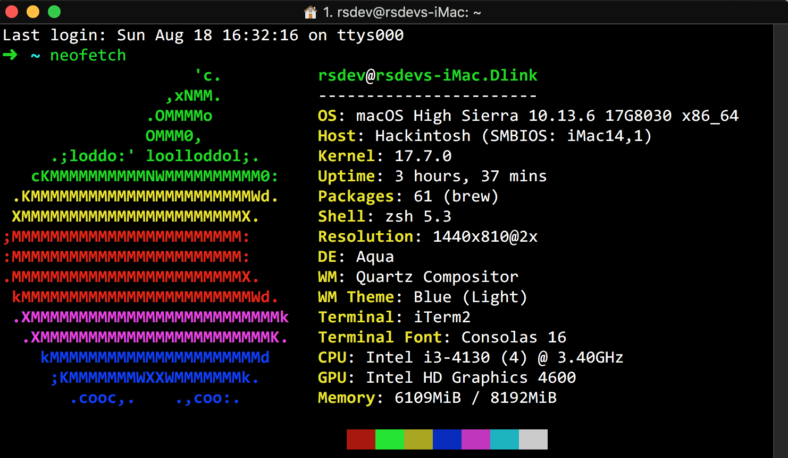
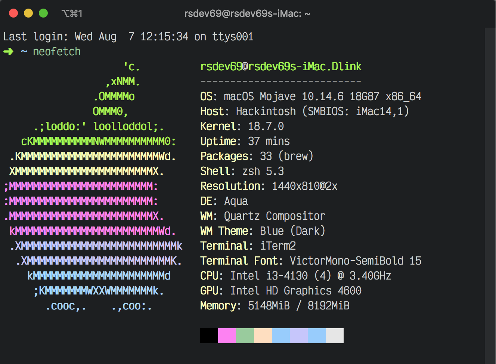
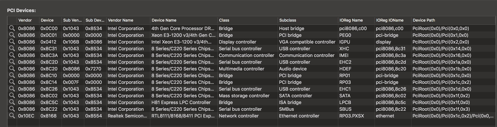
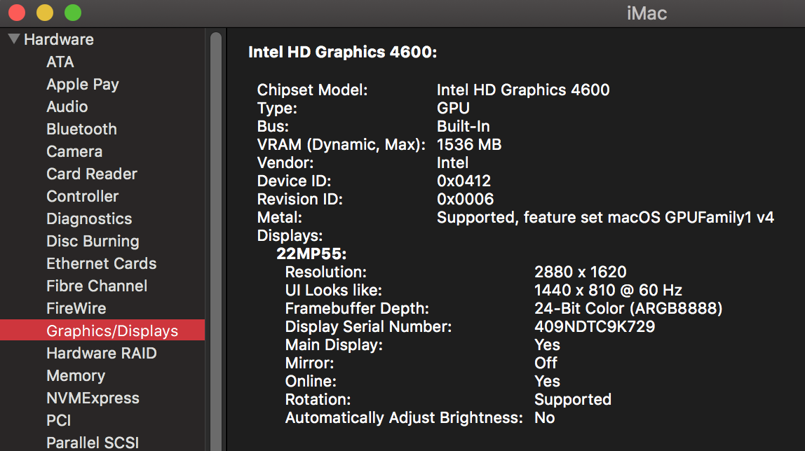
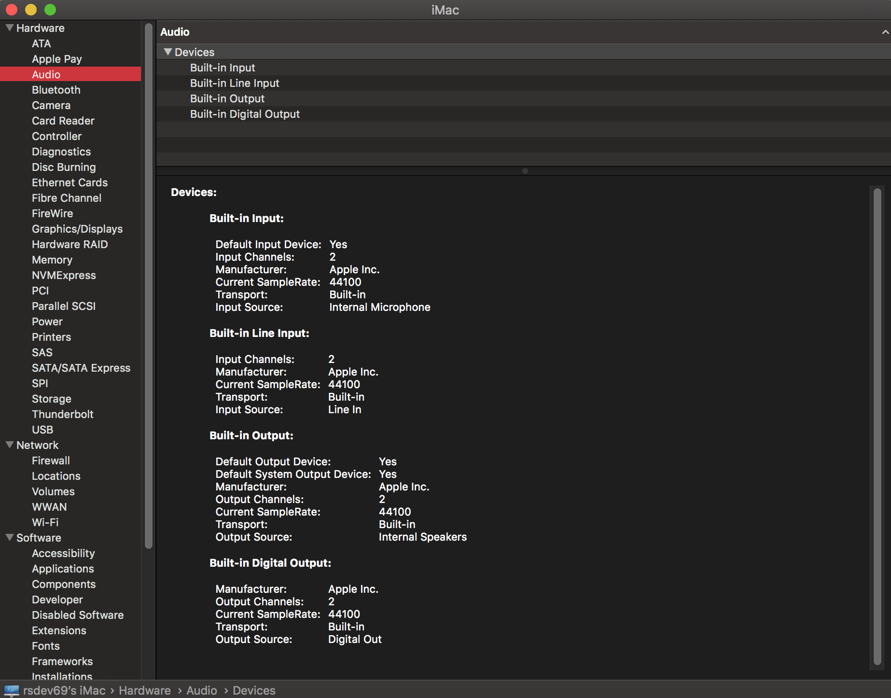
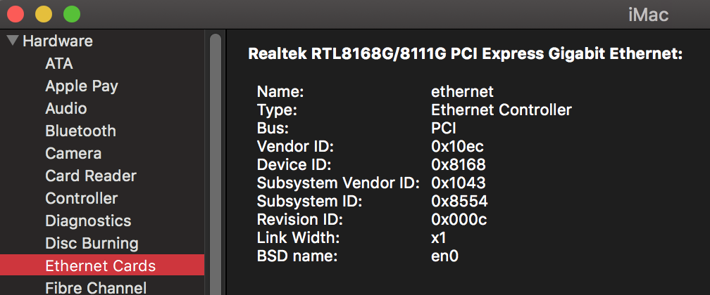
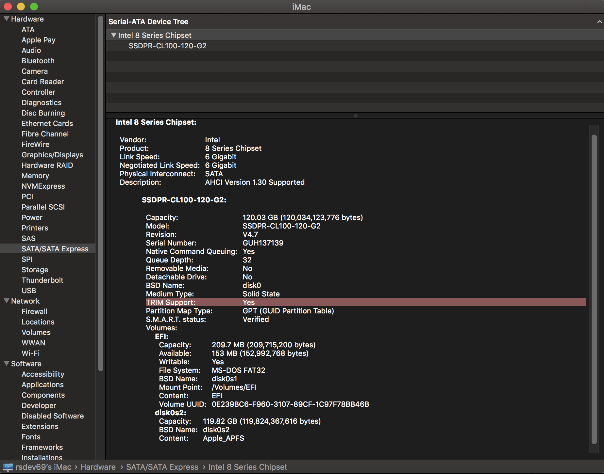
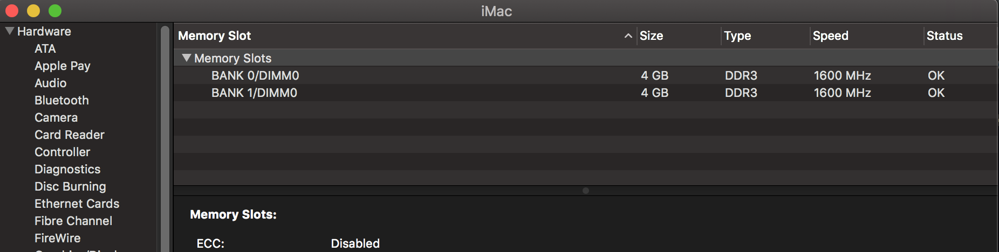
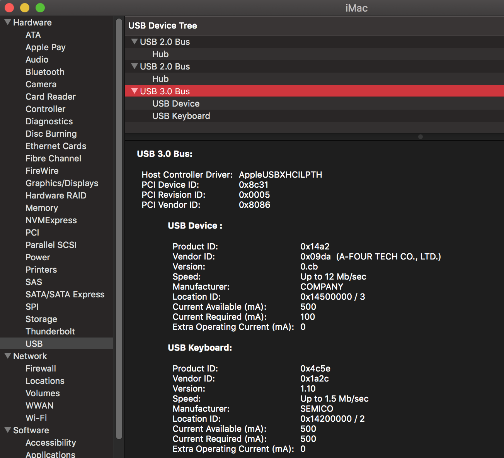
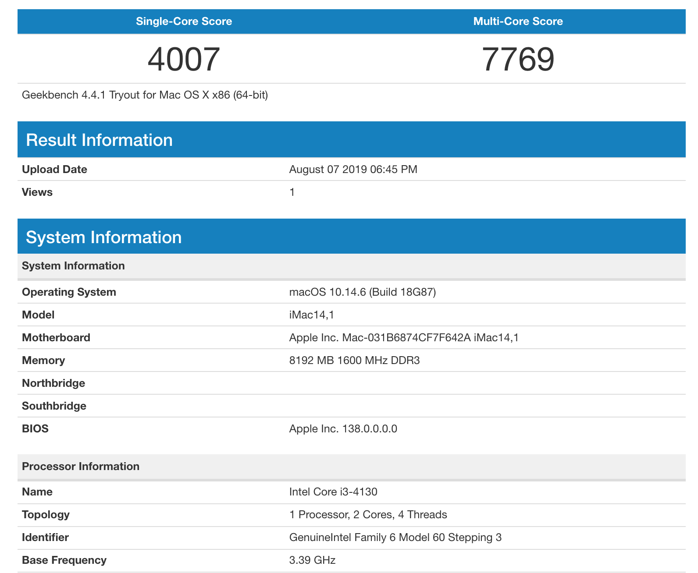
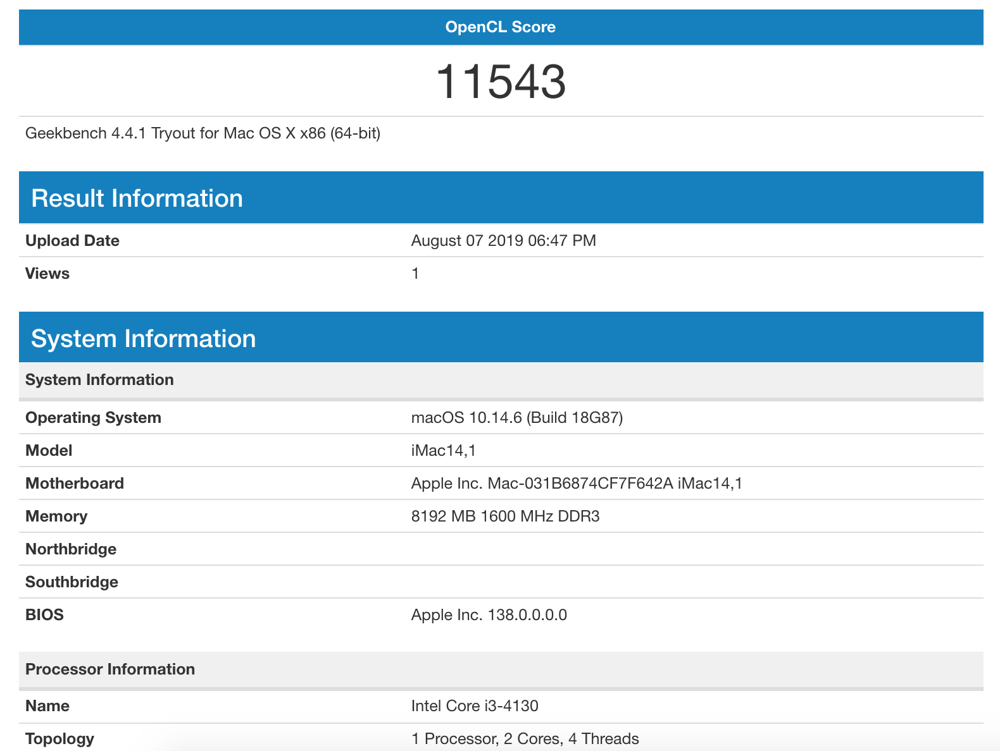
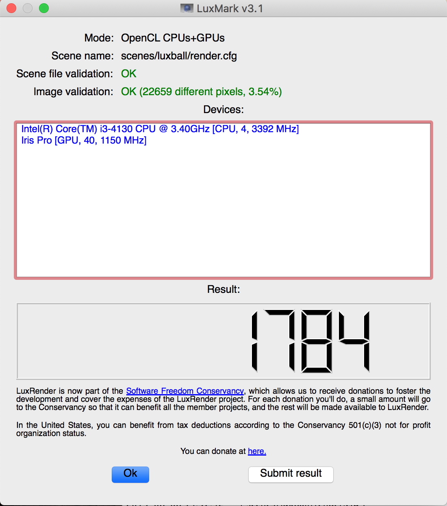
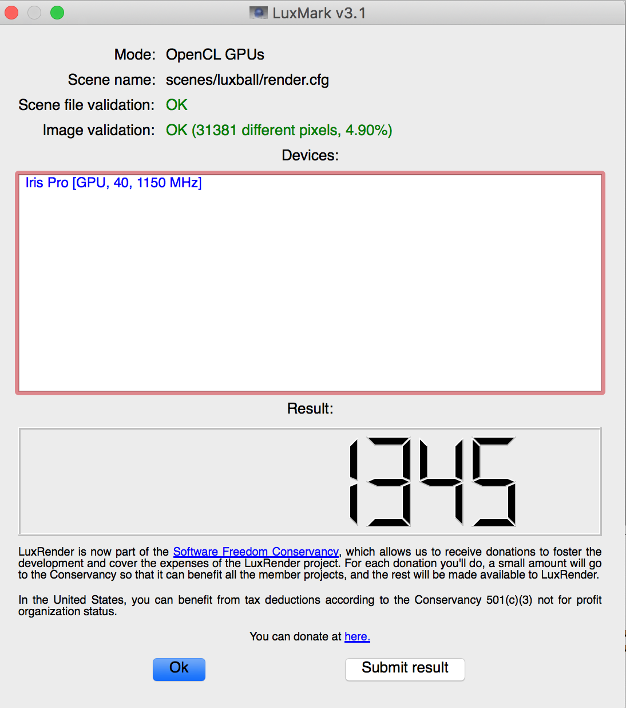